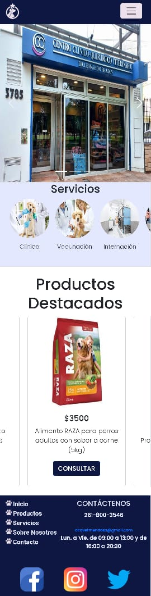

<h1 align="center">Centro Clínico Veterinario</h1>
<h3 align="center">CCQ es una página web de una veterinaria en la cual se puede encontrar gran variedad de productos y servicios. </h3>
<h2>Screenshots de algunas vistas </h2>

<h2>Implementé:</h2>
<ul>
<li>SASS</li>
<li>SEO (keywords y description )</li>
<li>@Media + Pseudoclases</li>
<li>Grid y flexbox</li>
</ul>
<h3 align="left">Lenguajes y Herramientas utilizadas:</h3>

    

